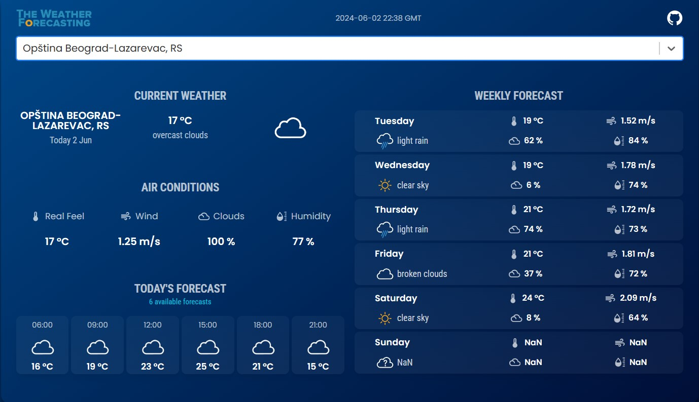

# Aplikacija za vremensku prognozu

Ova aplikacija omogućava korisnicima da pretražuju vremensku prognozu za različite lokacije koristeći OpenWeather API servis u pozadini. Aplikacija takođe pruža predviđanje vremenskih uslova za narednih 7 dana.




## Karakteristike

- Pretraga trenutne vremenske prognoze za bilo koju lokaciju
- Prikaz detaljne vremenske prognoze za narednih 7 dana
- Podaci uključuju temperaturu, vlažnost, brzinu vetra i druge relevantne informacije
- Jednostavan i intuitivan korisnički interfejs


## Konfiguracija

1. Registrujte se na [OpenWeather](https://openweathermap.org/) i kreirajte API ključ.
2. Kreirajte `.env` fajl u root direktorijumu projekta i dodajte vaš API ključ:
    ```
    OPENWEATHER_API_KEY=vaš_api_ključ
    ```"# the-weather-forecasting" 
